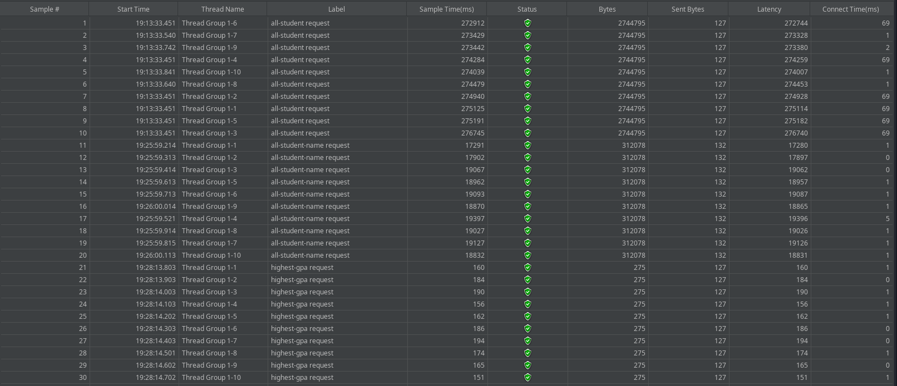
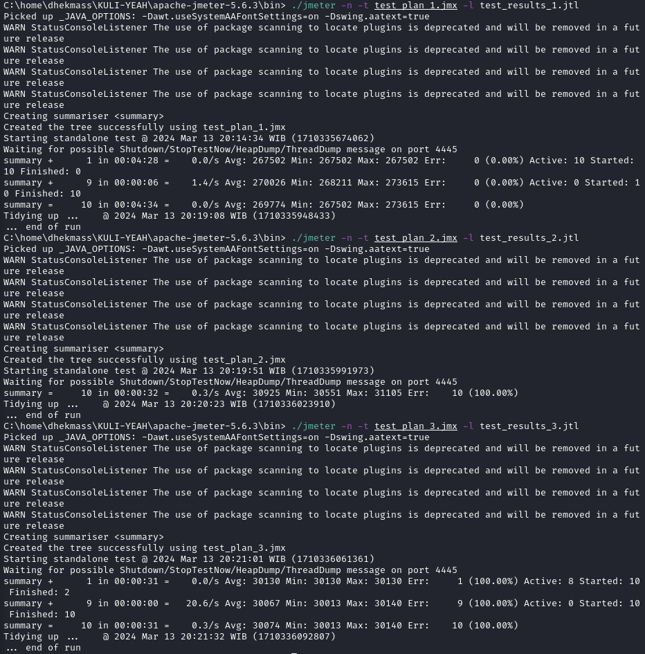

1. jmeter mengetest waktu yang dibutuhkan oleh semua resource pada system, sedangkan intellij profiler mengidentifikasi resource yang dibutuhkan oleh setiap code.
2. Dengan melihat code mana yang membutuhkan resource yang tidak wajar, sehingga dapat merefactor code agar membutuhkan resource yang wajar.
3. Ya.
4. tirintangan terbesar yaitu malas untuk melakukan refactor karena harus kembali mengecek lebih dalam codenya. Solusinya yaitu ingat bahwa kerja keras walaupun pahit tapi akan menghasilkan hasil yang manis.
5. Mengetahui code mana yang membutuhkan resource yang tidak wajar sehingga bisa di refactor.
6. melakukan testing dengan jmeter berulang kali. Jika masih tidak konsisten, maka akan saya cek semua code satu demi satu secara manual.
7. Cukup refactor code yang smells. Untuk mengecek bahwa application's functionality tidak terpengaruh, saya menggunakan postman yang akan mengecek setiap endpoint.